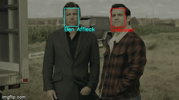
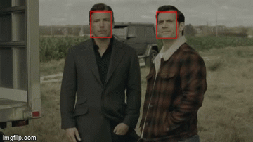

## Face Recognition in a Video
This is a Facial Recognition in a Video application developed for **learning and implementation purpose only**. In this repository a we will try to detect and recognise faces of six individuals namely Aditya Solanki(Author), Ben Affleck, Madonna, Elton John, Jerry Seinfled, Mindy Kaling. The complete process is divided into 4 parts:

1. **Face Detection in a each frame of the video**
2. **Implementation of FaceNet model on the extracted face**
3. **Implementation of Linear Support Vector Machine to recognise the face**
4. **Tagging the Recognised Face and saving the video** 



## Motivation
For the last one year, I have been part of a great learning curve wherein I have upskilled myself to move into a Machine Learning and Cloud Computing. This project second in the line where I am trying to recognise faces in a video.

## Libraries/framework used

<b>Built with</b>
- [Keras](https://keras.io/)
- [TensorFlow](https://www.tensorflow.org/)
- [scikit-learn](https://scikit-learn.org/stable/)


## Code Example

```bash
    # clone this repo, removing the '-' to allow python imports:
    git clone https://github.com/adityasolanki205/Face-Recognition-in-a-Video.git
```

## Installation

Below are the steps to setup the enviroment and run the codes:

1. **Data Setup**: First the data setup has to be done. Download the [5 celebrity Dataset, Kaggle](https://www.kaggle.com/dansbecker/5-celebrity-faces-dataset). After the Download create one more sub folder in train and test folders for your own photos. Provide as diverse photos as you can find. 

2. **Face Detection**: Now we need to detect a face in the dataset. To do that we will use [Multi-Task Cascaded Convolutional Neural Network](https://arxiv.org/abs/1604.02878) (MTCNN). This process will provide the co-ordinates of pixels to identify the face in the photo. Same process can be done to fetch more than one face from a photo with multiple people. 

```python
    # All the codes are written in Jupyter Notebooks

    # Install MTCNN
    !pip install mtcnn
    
    # To Preprocess the image install PIL 
    !pip install PIL
    
    # Preprocess the image into 'RGB' and convert it into numpy array
    image = np.asarray(image.convert('RGB'))
    
    # Use MTCNN object to detect faces using detect_faces() method
    faces = MTCNN.detect_faces(image)
```

3. **Face Embeddings**: After face extraction, we will fetch the face embedding using [FaceNet](https://github.com/davidsandberg/facenet). Downloaded the model [here](https://drive.google.com/drive/folders/1pwQ3H4aJ8a6yyJHZkTwtjcL4wYWQb7bn). After running this code for all the faces in train and test folders, we can save the embeddings using [np.saves_compressed](https://numpy.org/doc/stable/reference/generated/numpy.savez_compressed.html)

```python
    # The Dimension of the input has to be increased as the model expects input in the form (Sample size, 160, 160,3)
    samples = np.expand_dims(image_pixels, axis = 0)
    
    # Use the Predict method to find the Embeddings in the face. Output would be 1D vector of 128 embeddings of that face
    embeddings = model.predict(samples)
```

4. **Training the SVM model on these Embeddings**:  Now we will train SVM model over the embeddings to predict the face of a person.

```python
    # We will use Linear SVM model to train over the embeddings
    model = SVC(kernel = 'linear', probability=True).fit(X_train,y_train)
```

5.  **Predict the Face**: After the training of SVM model we will predict the face over test dataset.

```python
    # Preprocessing of the test photos have to be done like we did for Train and Validation photos
    image = np.asarray(image.convert('RGB'))
    
    # Now extract the face
    faces = MTCNN.detect_faces(image)
    
    # Extract embeddings
    embeddings = model.predict(samples)
    
    # At last we will predict the face embeddings
    SVM_model.predict(X_test)
```

6. **Detect a Face in Video**: Now we will try to detect the face in all the frame of the Video. For that we will use cv2 to capture all the frames of the video

```python
    #Here we will capture the video frame by frame and detect the faces
    cap = cv2.VideoCapture('../data/ben_batman.mp4')
    
    result = MTCNN.detect_faces(frame)
```

7. **Predict the face in the Video**: At last we will predict the faces in each frame and tag them accordingly.

```python
    #Here we will try to predict every face in each frame
    SVM_model.predict(result)
```

## Tests
To test the code we need to do the following:

    1. Copy the Video to be tested in 'Test' subfolder of 'Data' folder. 
       Here I have used a Video of Batman and Superman

    
    2. Goto the 'Face Detection frames of a Video' Folder and Open the 'Face Detection.ipynb'. It will help us 
       find the faces present in the video in Each Frame

    
    3. After Detecting the face, go to the 'Face recognition in a Video' folder and open 'Face Recognition' ipynb
       file 'cap' variable and  provide the path to your Video and run the complete code. The recognised faces     
       would have been highlighted and a Video would be saved by the name 'output.avi'


**Note**: The boundary boxes are color coded in a way that all the recognised faces will be aqua color and unknown will be red


## How to use?
To run the complete code, follow the process below:

    1. Create Data Folder. 
    
    2. Create Sub folders as Training and Validation Dataset
    
    3. Create all the celebrity folders with all the required photos in them. 
    
    4. Run the Train and Test Data.ipynb file under Training Data Creation folder
    
    5. Save the output as numpy arrays
    
    6. Run the Face embedding using FaceNet.ipynb under the same folder name. This will create training data 
       for SVM model
    
    7. Run the Face Recignition.ipynb in Face recognition in a Video folder to recognise a familiar face in the
       video


## Credits
1. David Sandberg's facenet repo: [https://github.com/davidsandberg/facenet](https://github.com/davidsandberg/facenet)
2. Tim Esler's Git repo:[https://github.com/timesler/facenet-pytorch](https://github.com/timesler/facenet-pytorch)
3. Akash Nimare's README.md: https://gist.github.com/akashnimare/7b065c12d9750578de8e705fb4771d2f#file-readme-md
